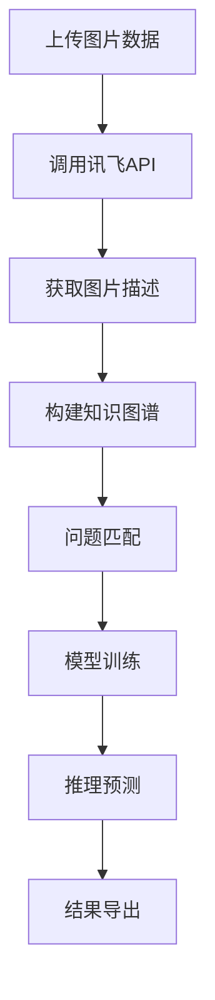

# 复杂图文逻辑推理挑战赛解决方案 - 产品需求文档

## 1. 产品概述

本项目旨在构建一个基于讯飞星火大模型的复杂图文逻辑推理系统，通过图片理解API将图像内容转换为结构化文本描述，结合问题进行逻辑推理，最终生成准确答案。

该系统解决了多模态AI在复杂逻辑推理场景下的应用问题，为参赛者提供高效的图文理解和推理能力，评估指标采用Character Jaccard Similarity确保答案质量。

## 2. 核心功能

### 2.1 用户角色

| 角色 | 注册方法 | 核心权限 |
|------|----------|----------|
| 开发者 | 系统配置 | 可配置API参数、训练模型、查看系统日志 |
| 用户 | 直接使用 | 可上传图片、提交问题、获取推理结果 |

### 2.2 功能模块

本系统包含以下核心页面：
1. **数据处理页面**：图片上传、API调用、文本转换功能
2. **模型训练页面**：训练数据管理、模型训练监控、性能评估
3. **推理预测页面**：测试数据处理、批量预测、结果导出
4. **系统配置页面**：API配置、参数调优、日志查看

### 2.3 页面详情

| 页面名称 | 模块名称 | 功能描述 |
|----------|----------|----------|
| 数据处理页面 | 图片理解模块 | 调用讯飞图片理解API，将图片转换为结构化文本描述，支持批量处理 |
| 数据处理页面 | 文本预处理模块 | 清洗和标准化文本数据，提取关键信息，构建知识图谱边集 |
| 模型训练页面 | 数据管理模块 | 管理训练集(100条)和测试集(384条)，支持数据查看和编辑 |
| 模型训练页面 | 训练监控模块 | 实时监控模型训练进度，显示损失函数和评估指标变化 |
| 推理预测页面 | 批量预测模块 | 对测试集进行批量推理预测，生成答案并计算相似度得分 |
| 推理预测页面 | 结果导出模块 | 按照sample_submit.csv格式导出预测结果，支持CSV下载 |
| 系统配置页面 | API配置模块 | 配置讯飞API认证信息(APPID、APISecret、APIKey)和连接参数 |
| 系统配置页面 | 日志监控模块 | 查看系统运行日志、API调用记录和错误信息 |

## 3. 核心流程

### 主要用户操作流程：

1. **数据预处理流程**：上传图片数据 → 调用讯飞图片理解API → 获取图片描述文本 → 构建知识图谱边集 → 与问题进行匹配

2. **模型训练流程**：加载训练数据 → 特征工程处理 → 模型训练 → 验证评估 → 参数调优 → 保存最优模型

3. **推理预测流程**：加载测试数据 → 图片理解处理 → 模型推理 → 生成答案 → 计算相似度 → 导出结果

## 4. 用户界面设计

### 4.1 设计风格

- **主色调**：深蓝色(#1890FF)和白色(#FFFFFF)
- **辅助色**：灰色(#F5F5F5)和绿色(#52C41A)
- **按钮样式**：圆角矩形，悬停效果
- **字体**：微软雅黑，主标题16px，正文14px
- **布局风格**：卡片式布局，左侧导航栏
- **图标风格**：线性图标，简洁现代

### 4.2 页面设计概览

| 页面名称 | 模块名称 | UI元素 |
|----------|----------|--------|
| 数据处理页面 | 图片上传区域 | 拖拽上传组件，支持批量选择，显示上传进度条和预览缩略图 |
| 数据处理页面 | API调用状态 | 实时显示API调用状态，成功/失败统计，响应时间监控 |
| 模型训练页面 | 训练参数配置 | 表单组件，包含学习率、批次大小、训练轮数等参数设置 |
| 模型训练页面 | 训练进度显示 | 进度条、损失曲线图、准确率变化图表 |
| 推理预测页面 | 结果展示表格 | 分页表格显示预测结果，包含ID、问题、预测答案、相似度得分 |
| 系统配置页面 | API配置表单 | 输入框组件，用于配置APPID、APISecret、APIKey等认证信息 |

### 4.3 响应式设计

系统采用桌面优先设计，支持1920x1080及以上分辨率，同时适配平板设备(768px以上)，提供良好的触摸交互体验。