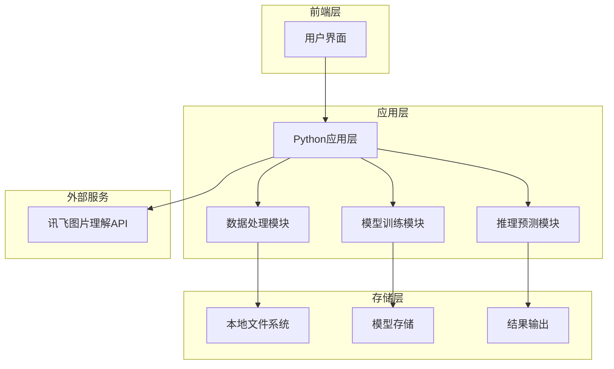
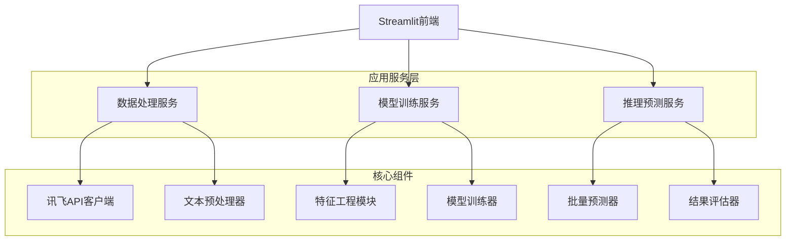
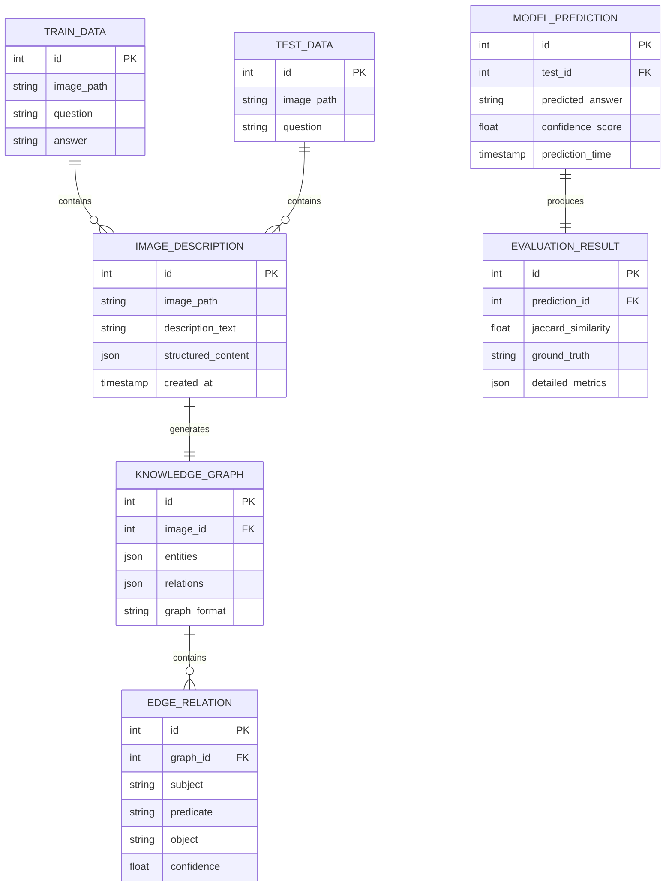

# 复杂图文逻辑推理挑战赛解决方案 - 技术架构文档

## 1. 架构设计



## 2. 技术描述

* **前端**: Streamlit + Python (用于快速构建交互界面)

* **后端**: Python + pandas + scikit-learn + transformers

* **API集成**: WebSocket客户端 + 讯飞星火图片理解API

* **数据存储**: 本地CSV文件 + pickle模型文件

* **机器学习**: BERT/RoBERTa + 自定义分类器

## 3. 路由定义

| 路由             | 目的                |
| -------------- | ----------------- |
| /home          | 主页面，显示项目概览和导航菜单   |
| /data\_process | 数据处理页面，图片理解和文本转换  |
| /model\_train  | 模型训练页面，训练监控和参数调优  |
| /inference     | 推理预测页面，批量预测和结果导出  |
| /config        | 系统配置页面，API设置和日志查看 |

## 4. API定义

### 4.1 核心API

**讯飞图片理解API调用**

```
WebSocket连接: wss://spark-api.cn-huabei-1.xf-yun.com/v2.1/image
```

请求参数:

| 参数名称        | 参数类型   | 是否必需 | 描述                                      |
| ----------- | ------ | ---- | --------------------------------------- |
| app\_id     | string | true | 应用ID: 5e0dd074                          |
| api\_key    | string | true | API密钥: 49e7eacaf518a39697317a21692a0cde |
| api\_secret | string | true | API密钥: NzA3YWQ1YjczNjFmZDgzMmMwOTk4Yjhj |
| image\_data | string | true | Base64编码的图片数据                           |
| question    | string | true | 针对图片的问题文本                               |

响应参数:

| 参数名称               | 参数类型   | 描述          |
| ------------------ | ------ | ----------- |
| status             | int    | 响应状态码       |
| content            | string | 图片理解结果文本    |
| reasoning\_content | string | 模型推理过程(如支持) |

示例请求:

```json
{
  "header": {
    "app_id": "5e0dd074",
    "uid": "user123"
  },
  "parameter": {
    "chat": {
      "domain": "image",
      "temperature": 0.5,
      "max_tokens": 2048
    }
  },
  "payload": {
    "message": {
      "text": [
        {
          "role": "user",
          "content": "请详细描述这张图片中的内容，包括人物、物体、场景、文字等信息"
        }
      ],
      "image_url": "data:image/png;base64,iVBORw0KGgoAAAANSUhEUgAA..."
    }
  }
}
```

## 5. 服务架构图



## 6. 数据模型

### 6.1 数据模型定义



### 6.2 数据定义语言

**训练数据表 (train\_data)**

```sql
-- 创建训练数据表
CREATE TABLE train_data (
    id INTEGER PRIMARY KEY,
    image_path VARCHAR(255) NOT NULL,
    question TEXT NOT NULL,
    answer TEXT NOT NULL,
    created_at TIMESTAMP DEFAULT CURRENT_TIMESTAMP
);

-- 创建索引
CREATE INDEX idx_train_data_id ON train_data(id);
CREATE INDEX idx_train_data_image ON train_data(image_path);

-- 初始化数据 (从train.csv导入)
INSERT INTO train_data (id, image_path, question, answer)
SELECT id, image, question, answer FROM 'train.csv';
```

**图片描述表 (image\_descriptions)**

```sql
-- 创建图片描述表
CREATE TABLE image_descriptions (
    id INTEGER PRIMARY KEY AUTOINCREMENT,
    image_path VARCHAR(255) NOT NULL,
    description_text TEXT,
    structured_content JSON,
    api_response_time FLOAT,
    created_at TIMESTAMP DEFAULT CURRENT_TIMESTAMP
);

-- 创建索引
CREATE INDEX idx_image_desc_path ON image_descriptions(image_path);
CREATE INDEX idx_image_desc_created ON image_descriptions(created_at);
```

**知识图谱表 (knowledge\_graphs)**

```sql
-- 创建知识图谱表
CREATE TABLE knowledge_graphs (
    id INTEGER PRIMARY KEY AUTOINCREMENT,
    image_id INTEGER,
    entities JSON,
    relations JSON,
    edge_list JSON,
    graph_format VARCHAR(50) DEFAULT 'edge_list',
    created_at TIMESTAMP DEFAULT CURRENT_TIMESTAMP,
    FOREIGN KEY (image_id) REFERENCES image_descriptions(id)
);

-- 创建索引
CREATE INDEX idx_kg_image_id ON knowledge_graphs(image_id);
CREATE INDEX idx_kg_created ON knowledge_graphs(created_at);
```

**模型预测表 (model\_predictions)**

```sql
-- 创建模型预测表
CREATE TABLE model_predictions (
    id INTEGER PRIMARY KEY AUTOINCREMENT,
    test_id INTEGER NOT NULL,
    predicted_answer TEXT NOT NULL,
    confidence_score FLOAT,
    model_version VARCHAR(50),
    prediction_time TIMESTAMP DEFAULT CURRENT_TIMESTAMP
);

-- 创建索引
CREATE INDEX idx_pred_test_id ON model_predictions(test_id);
CREATE INDEX idx_pred_time ON model_predictions(prediction_time);

-- 初始化预测结果表结构
INSERT INTO model_predictions (test_id, predicted_answer, confidence_score)
SELECT id, '', 0.0 FROM 'test.csv';
```

**评估结果表 (evaluation\_results)**

```sql
-- 创建评估结果表
CREATE TABLE evaluation_results (
    id INTEGER PRIMARY KEY AUTOINCREMENT,
    prediction_id INTEGER,
    jaccard_similarity FLOAT,
    character_similarity FLOAT,
    ground_truth TEXT,
    detailed_metrics JSON,
    evaluation_time TIMESTAMP DEFAULT CURRENT_TIMESTAMP,
    FOREIGN KEY (prediction_id) REFERENCES model_predictions(id)
);

-- 创建索引
CREATE INDEX idx_eval_pred_id ON evaluation_results(prediction_id);
CREATE INDEX idx_eval_jaccard ON evaluation_results(jaccard_similarity DESC);
```

